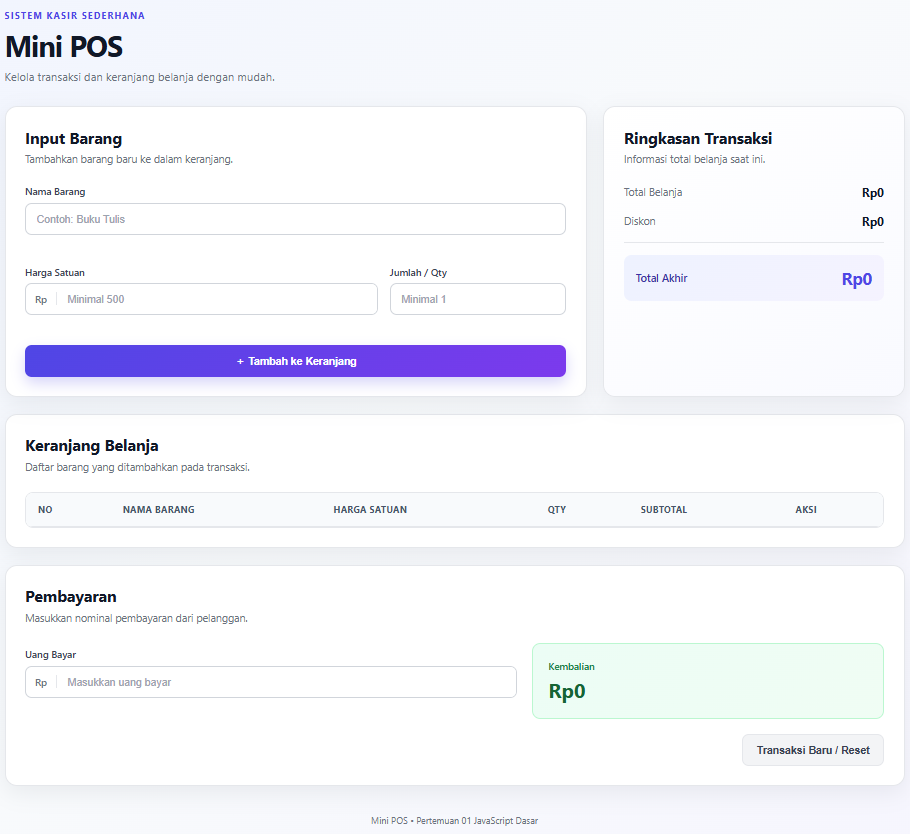
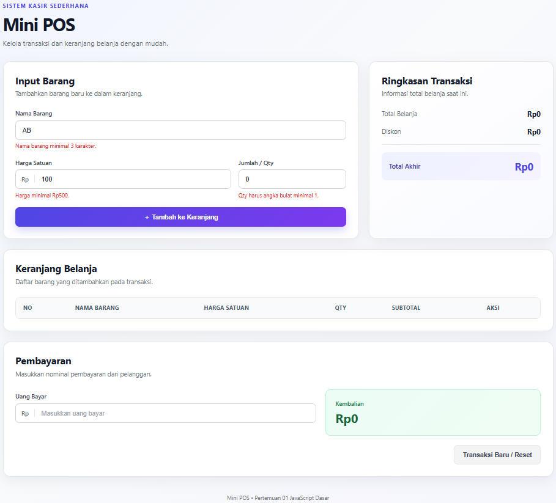
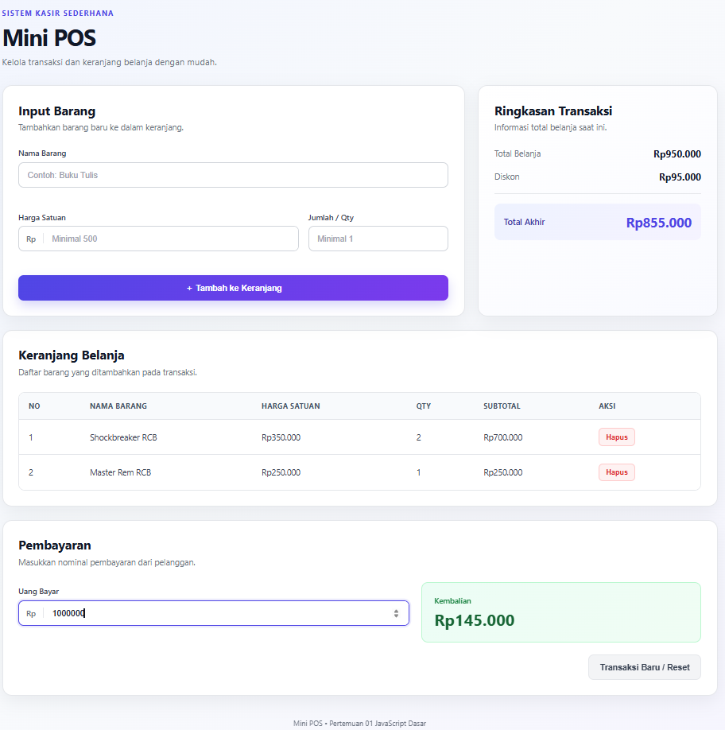

# Mini POS - Aplikasi Kasir & Keranjang Belanja Sederhana

## Identitas

- **Nama Lengkap:** Muhamad Rafi Ilham
- **NIM:** 123140173
- **Kelas Praktikum:** PAW RB

## Deskripsi Aplikasi

Mini POS merupakan aplikasi web kasir dan keranjang belanja sederhana yang dapat digunakan untuk membantu proses transaksi pada kantin atau toko kampus.

Aplikasi ini memungkinkan pengguna untuk menambahkan barang ke dalam keranjang, menghitung subtotal dan total belanja, memberikan diskon secara otomatis, menghitung pembayaran dan kembalian, serta menyimpan data keranjang menggunakan `localStorage`.

## Tujuan

Aplikasi Mini POS dibuat untuk menerapkan konsep dasar JavaScript yang telah dipelajari pada Pertemuan 01, meliputi:

- Validasi input form.
- Penggunaan variabel dan tipe data.
- Struktur kondisional.
- Perulangan dan pengolahan data.
- Fungsi dan event handler.
- Manipulasi DOM.
- Array dan object.
- Perhitungan otomatis.
- Penyimpanan data menggunakan `localStorage`.

## Fitur Aplikasi

- [x] Input nama barang.
- [x] Input harga satuan.
- [x] Input jumlah atau qty.
- [x] Validasi nama barang minimal 3 karakter.
- [x] Validasi harga satuan minimal Rp500.
- [x] Validasi qty berupa bilangan bulat minimal 1.
- [x] Pesan error jika input tidak valid.
- [x] Menambahkan barang ke keranjang.
- [x] Menampilkan daftar barang dalam tabel.
- [x] Menghitung subtotal setiap barang.
- [x] Menghitung total belanja secara otomatis.
- [x] Memberikan diskon 10% jika total belanja minimal Rp50.000.
- [x] Menghitung total akhir setelah diskon.
- [x] Input uang pembayaran.
- [x] Menghitung kembalian secara otomatis.
- [x] Menampilkan pesan jika uang pembayaran belum mencukupi.
- [x] Menghapus barang dari keranjang.
- [x] Menyimpan keranjang menggunakan `localStorage`.
- [x] Memuat kembali data keranjang setelah halaman di-refresh.
- [x] Tombol transaksi baru atau reset.
- [x] Format angka dalam bentuk Rupiah.
- [x] Tampilan responsif untuk desktop dan perangkat dengan layar lebih kecil.

## Panduan Menjalankan Aplikasi

1. Buka folder proyek menggunakan Visual Studio Code.
2. Pastikan file `index.html`, `style.css`, dan `script.js` berada pada folder utama proyek.
3. Buka file `index.html`.
4. Jalankan menggunakan ekstensi **Live Server** pada Visual Studio Code atau buka file melalui browser.
5. Masukkan nama barang, harga satuan, dan jumlah barang.
6. Klik tombol **Tambah ke Keranjang**.
7. Barang yang valid akan ditampilkan pada tabel keranjang belanja.
8. Sistem akan menghitung subtotal, total belanja, diskon, dan total akhir secara otomatis.
9. Masukkan nominal pada bagian **Uang Bayar**.
10. Sistem akan menghitung kembalian secara otomatis.
11. Gunakan tombol **Hapus** untuk menghapus barang tertentu dari keranjang.
12. Gunakan tombol **Transaksi Baru / Reset** untuk mengosongkan seluruh keranjang setelah transaksi selesai.

## Penjelasan Teknis

### 1. Validasi Input

Validasi dilakukan ketika form input barang dikirim. Sistem memeriksa tiga data utama, yaitu nama barang, harga satuan, dan qty.

Nama barang harus memiliki minimal 3 karakter. Harga satuan harus bernilai minimal Rp500, sedangkan qty harus berupa bilangan bulat minimal 1.

Jika salah satu input tidak memenuhi ketentuan, sistem akan menampilkan pesan error dan barang tidak akan dimasukkan ke dalam keranjang.

### 2. Pengelolaan Keranjang

Setiap barang yang berhasil melewati proses validasi disimpan ke dalam array `keranjang` dalam bentuk object.

Setiap object barang memiliki data:

- Nama barang.
- Harga satuan.
- Qty.

Data tersebut kemudian ditampilkan pada tabel keranjang menggunakan manipulasi DOM.

### 3. Perhitungan Subtotal

Subtotal setiap barang dihitung menggunakan rumus:

`Subtotal = Harga Satuan × Qty`

Contoh:

`Rp20.000 × 2 = Rp40.000`

### 4. Perhitungan Total Belanja

Total belanja diperoleh dengan menjumlahkan seluruh subtotal barang yang terdapat di dalam keranjang.

Perhitungan dilakukan ulang setiap kali terdapat barang baru atau barang dihapus dari keranjang.

### 5. Perhitungan Diskon

Jika total belanja mencapai minimal Rp50.000, sistem memberikan diskon sebesar 10%.

Rumus diskon:

`Diskon = Total Belanja × 10%`

Total akhir kemudian dihitung menggunakan rumus:

`Total Akhir = Total Belanja - Diskon`

### 6. Pembayaran dan Kembalian

Pengguna dapat memasukkan nominal uang yang diterima pada bagian **Uang Bayar**.

Jika uang yang diberikan lebih kecil dari total akhir, sistem akan menampilkan informasi bahwa uang belum mencukupi.

Jika uang mencukupi, kembalian dihitung menggunakan rumus:

`Kembalian = Uang Bayar - Total Akhir`

### 7. LocalStorage

Data keranjang disimpan pada browser menggunakan `localStorage`.

Data array keranjang diubah menjadi format JSON menggunakan:

`JSON.stringify()`

Data yang tersimpan kemudian dibaca kembali menggunakan:

`JSON.parse()`

Dengan mekanisme tersebut, isi keranjang tetap tersedia walaupun halaman browser di-refresh.

### 8. Format Rupiah

Nilai harga, subtotal, total belanja, diskon, total akhir, dan kembalian ditampilkan menggunakan format Rupiah agar lebih mudah dibaca.

Contoh:

`50000` menjadi `Rp50.000`

## Screenshot

### Gambar 1. Tampilan Utama Aplikasi Mini POS



Gambar 1 menunjukkan tampilan utama aplikasi Mini POS yang terdiri dari form input barang, ringkasan transaksi, keranjang belanja, dan bagian pembayaran.

### Gambar 2. Tampilan Validasi Input Barang



Gambar 2 menunjukkan proses validasi ketika data yang dimasukkan tidak memenuhi ketentuan. Sistem menampilkan pesan error pada input yang tidak valid.

### Gambar 3. Tampilan Hasil Transaksi dan Perhitungan



Gambar 3 menunjukkan barang yang telah dimasukkan ke dalam keranjang beserta hasil perhitungan subtotal, total belanja, diskon, total akhir, uang pembayaran, dan kembalian.

## Struktur Folder

```text
[NAMA]_123140173_pertemuan1/
├── index.html
├── style.css
├── script.js
├── README.md
├── screenshot1.png
├── screenshot2.png
├── screenshot3.png
└── modul/
    ├── index.html
    ├── style.css
    └── script.js